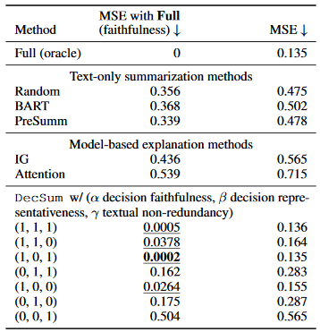

# CSE6741 Replication Project

A replication of part of Table 1 from "Decision-Focused Summarization" ([link](https://api.semanticscholar.org/CorpusID:237513705)).

Borrows some structure from the paper's released codebase [here](https://github.com/ChicagoHAI/decsum).

## Writeup

### Introduction

The paper introduces the new task of "decision-focused summarization": generating summaries of a text to present relevant information for a decision being made that takes that text into account.
This is in contrast to most previous work on text summarization, which has sought to create general summaries of texts.
An example that the authors give to contrast these two scenarios is with medical diagnoses based on text medical notes: while medical text may contain information about some patient's foot injuries, if the text is being used for pancreatic cancer risk assessment, a summary of the text that contains information about foot injuries is very unlikely to be helpful.

The authors make several clear contributions:
- They build a dataset for this task (predicting Yelp score ratings based on the text of a review)
- They propose three goals of a decision-focused summarization (faithfulness, representativeness, and sentence distinctness/diversity)
- They describe a summarization algorithm `DecSum` that selects sentences from a larger set of reviews based on these goals as a way of generating a summary
- They evaluate `DecSum` against three text-based summarization methods (random text selection, `BART`, and `PreSumm`) and two decision-model-based summarization methods (`IG`, `Attention`) using mean squared error between predictions made by a decision model on the original texts and the summaries as the reference metric.
- They evaluate these same summarization methods against each other with crowdsourced human decisions, judging on classification accuracy.

I focus on replicating parts of the first four points: building a dataset, implementing `DecSum`, implementing a subset of the other summarization methods they used, and comparing their mean squared error performance.

### Method

All data and code for this replication was newly collected and written, except for the `yelp_preprocess.py` script which is lightly adapted from the authors' public codebase.

Dataset collection:
- The authors don't include their full dataset in the repository, so I re-downloaded the most recent version of the Yelp dataset and re-did preprocessing on that dataset with a new randomly selected train/dev/test dataset split in the same ratio that they used.
- The dataset that I had is 15% larger than theirs. (Their test set had size=3623, my test set had size=4172.)

Finetuning Longformer:
- I finetuned on pretrained `longformer-base-4096` (NOT `longformer-large-4096`), as that is what the decsum codebase uses.
  Oddly enough, their appendix description seems to contradict their public codebase.
  They describe using a model with 102M parameters, which matches the size of `longformer-large-4096`.
  The Longformer paper reports that `longformer-base-4096` only has 41M parameters.
  However, if I estimate model size based on training time, their reported training time (over 3 hours) matches up with how much time I'd guess training `longformer-base-4096` takes, since I spent only slightly less time than that training a `longformer-base-4096` model with a higher-spec GPU (I used a RTX 3090, they reported using a RTX Titan).
- I use the exact same training hyperparameters as the authors describe in their appendix, other than changing the number of workers and the batch size.

Summarization:
- The public codebase does not contain any implementation of any summarization methods other than DecSum, so I needed to implement those from scratch with little reference to work off of.
- They mention that all sentence-based summaries are limited to N=50 tokens (words), in keeping with the average summary length of BART.
- DecSum: Given a quality function for a set of sentences selected that can take into account (faithfulness, representativeness, and diversity), does beam search (with default width=4) to select a subset of all review sentences that does best on this quality function while still being under the N-token limit.
  I order the sentences in this subset the same way they were initially ordered in the set of reviews in the test set, same as the original authors describe in the appendix.
  (They did do an exploration into how much impact sentence ordering had to do with final quality, and there did seem to be an impact. However, the main table I am trying to replicate defaulted to using original sentence ordering.)
  - The DecSum quality metric includes three components: "faithfulness", "representativeness", and "distinctness/diversity".
    - I excluded the "faithfulness" component of the DecSum summary quality metric, as that was reported to take over 10 hours per run on the test set and I didn't end up having time to let this run. (Maybe in the short-term future...)
      However, if I did implement this, it would have been based on calculating loss between prediction of the finetuned-Longformer on a set of sentences currently considered, and the full review sentence set.
    - The "representativeness" component is the logarithm of Wasserstein distance between the set of all predictions that would be made using the finetuned-Longformer on each sentence being considered individually, and a similar set of all per-sentence predictions across all sentences in the original review.
      To save time, I calculated the predictions for each sentence in the test set ahead of time and referenced those saved predictions when generating the summary.
    - The "distinctness/diversity" component is calculated as such: across all sentences that are being considered for summary inclusion, find the other sentence being considered that has maximal cosine similarity (using SentBert embeddings) and sum up those similarity metrics.
      Again, to save time, I calculated the SentBert embeddings ahead of time.
  - My implementation of DecSum doesn't follow their pseudocode / algorithm that they describe in "Algorithm 1" of the paper perfectly, as there seemed to be a typo in that algorithm.
    - The "X <- X - x" line causes X to decrease in size, which doesn't match up with how the overall loss functions are defined.
    - I would add an additional "Xoriginal <- X" before the while loop and replace all instances of "X" in the loss function calls with "Xoriginal".
  - Token count is based on SpaCy model token counting, *not* Longformer model token counting.
    - The original paper is not clear about how token counts were done. The implementation uses SpaCy model token counting.
    - The difference between these: SpaCy tends to use clearer rules for tokenization, and generally counts distinct words. Longformer tokenizer seems to pick up on word prefixes, suffixes, or other modifiers more often.
- Random: Prioritizes sentences in a random order, terminates adding sentences upon encountering one that will exceed the N-token limit.
  - The authors never clearly said how the token limit for the Random summarization method was implemented, but based on the codebase it seems to be done similarly to the DecSum method.
- PreSumm: Prioritizes sentences according to "importance" metrics judged by a `distilbert-base-uncased-ext-sum` model, as implemented in a third-party library `transformersum` ([link](https://github.com/HHousen/TransformerSum))
  - `distilbert-base-uncased` is the model the authors describe using, but their paper includes a footnote that links directly to the `TransformerSum` model checkpoint download page, with no model with that exact name that matches.
    I chose to use `distilbert-base-uncased-ext-sum`, as it is the model that seems most similar.
  - As with the other summarization methods, I use the same sentence prioritization, cutoff based on maximum token count, and re-sorting approach.
  - Since `distilbert-base-uncased-ext-sum` has an input token count limitation, I attempted to truncate the reviews being passed as input to a maximum of 510 tokens.
    (The true limit in the model is 512, but I wanted to avoid off-by-one errors...)
  - However, the `transformersum` implementation was still raising a "Token indices sequence length is longer than the specified maximum sequence length ... Running this sequence through the model will result in indexing errors" alert (with a much smaller difference between input and limit after text truncation, but still).
    I am not sure how to resolve this, and ended up giving up and hoping the summaries produced would not be too buggy.

Evaluation:
- The public codebase does not contain any evaluation methods, so I needed to implement those from scratch.
  (... Fortunately, MSE and MSE-Full are easier to implement than the reference summarization methods.)
- For each summarization method implemented, I calculated both MSE-Full and MSE metrics.
- The MSE-Full metric calculates MSE between the predictions made by finetuned-Longformer on the set of full-text reviews in the test set, and the predictions made by the same model on the set of generated summaries.
- The MSE metric calculates MSE between the true labels in the test set (the actual 50-review average score) and the predictions made in the generated summaries.

### Results

| Summarizer    | MSE-Full | MSE    |
|---------------|----------|--------|
| Full (oracle) | 0        | 0.1299 |
|---------------|----------|--------|
| Random        | 0.4017   | 0.4697 |
| PreSumm       | 0.3202   | 0.4572 |
|---------------|----------|--------|
| DecSum(0,1,1) | 0.1838   | 0.2723 |
| DecSum(0,1,0) | 0.1777   | 0.2537 |
| DecSum(0,0,1) | 0.5155   | 0.5715 |

In comparison, here is the results table from the original paper:



These results do not match numbers exactly, but the comparison between metrics across the different summarization methods remains accurate.
`PreSumm` does better than `Random` on the MSE-Full comparison, but don't have much of a difference on the regular MSE comparison.
Overall, both the `Random` and `PreSumm` summarization methods do better than `DecSum(0,0,1)`, but all other `DecSum` methods are better than the baseline methods.
For the parameters that I tested for `DecSum`, the more parameters are active, the better the summaries perform.

#### Runtimes

- Collecting the dataset and preprocessing took 5-ish minutes
- Finetuning `longformer-base-4096` took slightly under 3 hours (excluding times when it crashed when out-of-memory and I had to restart the training process from saved checkpoints) on a GeForce RTX 3090.
  - However, when I was initially trying to run this finetuning on Google Colab, the estimated finetuning time was over 36 hours (and it kicked me off of the server after about 4 hours of finetuning time).
- Generating DecSum(0,0,1) summaries for the test dataset took 10-ish minutes
  - Excluding 5min of sentence cache generation
- Generating DecSum(0,1,0) summaries for the test dataset took 10-ish minutes
  - Excluding 5min of sentence cache generation
  - Excluding 8hrs of per-sentence prediction cache generation
- Generating DecSum(0,1,1) summaries for the test dataset took 10-ish minutes
  - Excluding 5min of sentence cache generation
  - Excluding 8hrs of per-sentence prediction cache generation
  - Excluding 5min of sentence embedding cache generation
- Generating random summaries for the test dataset took 5-ish minutes
  - Excluding 5min of sentence cache generation
- Generating PreSumm summaries for the test dataset took 5-ish minutes
  - Excluding 5min of sentence cache generation
  - Excluding 30min of `distilbert` summarization scoring cache generation
- Evaluating summarization methods each took a trivial amount of time
  - Excluding 5min of baseline prediction cache generation
  - Excluding 5min of summary prediction cache generation per summary being evaluated

### Appendix: Tutorials referenced when implementing all of this...

Demo training scripts referenced:
- https://github.com/jlealtru/website_tutorials/blob/main/notebooks/Longformer%20with%20IMDB.ipynb (main reference)
- https://pytorch.org/tutorials/beginner/data_loading_tutorial.html (Dataset class implementation)
- https://huggingface.co/docs/transformers/tasks/sequence_classification
- https://github.com/huggingface/notebooks/blob/master/transformers_doc/training.ipynb

## Run instructions

### 1. Environment setup

See commands below to set up the main codebase and the Python environment:

```
# Set up a python 3.8 conda environment first
# Then clone this codebase...
git clone https://github.com/cephcyn/cornell_cs6741_summ_replication.git
# Install dependencies
pip install -r requirements.txt
pip install torch==1.11.0+cu113 -f https://download.pytorch.org/whl/cu113/torch_stable.html
python -m spacy download en_core_web_sm
```

If you want to, edit the `constants.py` file to alter experiment hyperparameters.
Arguments given in some individual commands below will override these defaults.

#### Running PreSumm summarization

If/when running PreSumm summarization, set up `TransformerSum` packages ([main ref here](https://transformersum.readthedocs.io/en/latest/index.html)).

```
git clone https://github.com/HHousen/transformersum.git
cd transformersum
# Add TransformerSum dependencies to the current environment
conda env update -f environment.yml
```

Download the `distilbert-base-uncased-ext-sum` pretrained on the CNN/DM dataset from [here](https://transformersum.readthedocs.io/en/latest/extractive/models-results.html#pretrained-ext).
Rename it and save it in the path described in `constants.PRESUMM_MODEL_FNAME`.

(
TODO: 
Currently, the summarizer tools are all dependent on TransformerSum packages because of imports in the `generate_summaries.py` tools. 
Figure out some way to separate these in the future?
)

### 2. Dataset
Download the Yelp JSON dataset in `.tgz` format: https://www.yelp.com/dataset/download

Unzip the dataset to `YELP_DATA_DIR`:

```
tar -xvzf YELP_DATA_TGZ -C YELP_DATA_DIR
```

Preprocess the dataset into the task format (this uses a lightly modified version of the preprocessing script from the original paper codebase):

```
python -m yelp_preprocess [--yelp_data_dir YELP_DATA_DIR] [--output_dir OUTPUT_DIR] [--num_review NUM_REVIEWS]
```

### 3. Longformer finetuning

Run to finetune the Longformer evaluation model:

```
python -m longformer_finetune
```

The following summarization generation and evaluation code will not work without this model existing.

### 4. Run summarization generators

Run the summarization generator for each type of summary we want to evaluate:

```
python -m generate_summaries --summary_type random
python -m generate_summaries --summary_type presumm
python -m generate_summaries --summary_type decsum011
python -m generate_summaries --summary_type decsum010
python -m generate_summaries --summary_type decsum001
```

### 5. Evaluate

Run the summarization evaluator for each type of summary that was generated:

```
python -m score_summaries --summary_type random
python -m score_summaries --summary_type presumm
python -m score_summaries --summary_type decsum011
python -m score_summaries --summary_type decsum010
python -m score_summaries --summary_type decsum001
```

### Additional Notes

The code is not fully cleaned up to create directories when needed.
Running it from its current state on the repository will likely cause several "directory does not exist" type issues.
The structure that it is roughly expecting (based on the default `constants.py` setup) is:

```
base_directory
  - dataset_raw
  - dataset
    - 50reviews
  - logging
  - checkpoints
  - summaries
    - 50reviews
  - scoring
  - backups
    - 50reviews
```

If you adjust the constants (especially the review count), be sure to clear out (or backup / change the name of) resources in all directories other than the `dataset_raw` directory, as files saved there do not take adjusted review count into account.

A more general list of directory content dependencies:
- `dataset` is dependent on `dataset_raw`
- `checkpoints` is dependent on `dataset`
- `logging`, `summaries`, `backups` are dependent on `checkpoints`, `dataset`
- `scoring` is dependent on `dataset`, `summaries`, `checkpoints`, `backups`
